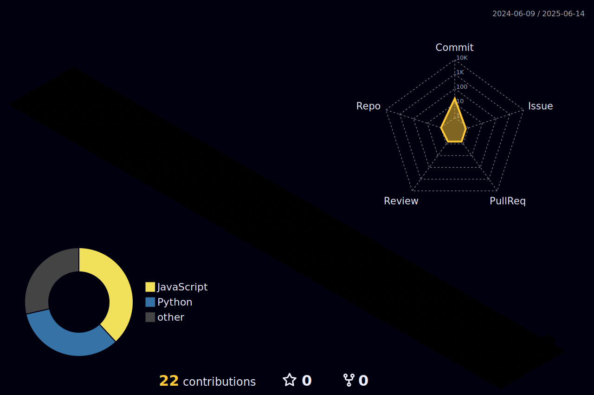

# Hi there, I'm Nikhila Koneru! 

  
  

## About Me

Hello! I'm **Nikhila Koneru**, a passionate **Cloud Computing Engineer**, **Full Stack Web Developer**, and **Blockchain Enthusiast**. Currently, I'm pursuing my Master's in Computer Science at [Northeastern University](https://www.northeastern.edu/) in Portland, Maine. I love building scalable web applications, optimizing cloud infrastructure, and exploring cutting-edge technologies across modern web platforms.

- 🔭 I'm currently working on cloud computing and full stack web development projects  
- 🌱 I'm continuously learning advanced cloud technologies, modern web frameworks, and AI/ML applications  
- 👯 I'm looking to collaborate on innovative web applications, cloud solutions, and Web3 projects  
- 💬 Ask me about React, Node.js, Cloud Computing, Full Stack Development, Firebase, AWS, and Blockchain  
- 😄 Pronouns: She/Her  
- ⚡ Fun fact: I've processed 1000+ Bitcoin micro-transactions in my Lightning Network project!

## 🚀 Tech Stack & Skills

### 💻 Programming Languages

### 🎨 Frontend & Mobile Development

### ⚙️ Backend Development

### 🗄️ Databases & Cloud

### 🚀 DevOps & Deployment

### 🔗 Blockchain & Web3

### 🤖 AI/ML & Data Science

### 🛠️ Development Tools

## 🎯 Areas of Expertise

<table>
  <tr>
    <td align="center" width="200">
       
      <strong>Cloud Computing</strong> 
      <em>Infrastructure optimization & CI/CD</em>
    </td>
    <td align="center" width="200">
       
      <strong>Full Stack Web Development</strong> 
      <em>Modern web applications & APIs</em>
    </td>
    <td align="center" width="200">
       
      <strong>Blockchain Development</strong> 
      <em>Lightning Network & DeFi applications</em>
    </td>
  </tr>
</table>

## 🚀 Featured Projects

### 📱 NoteIT - Mobile Note Sharing App
**Tech Stack:** Android Studio, Firebase Authentication, Firebase Realtime Database  
- 🎯 **150+ daily note uploads** with seamless Firebase Storage integration
- 🔒 **100% secure user access** validated through penetration testing
- 🔍 **30% boost in note discoverability** through efficient search features

### 💻 NeuNotes - Collaborative Web Platform  
**Tech Stack:** React.js, Node.js, SQL  
- 📈 **25% increase in daily active users** with real-time collaboration features
- ⚡ **35% enhanced UX engagement** through responsive React.js interface
- 🛡️ **100% data integrity** with SQL database optimization

### ⚡ LightningTime - Bitcoin Rewards Time Tracker
**Tech Stack:** React, Node.js, LNbits, Lightning Network  
- 💰 **1000+ micro-transactions processed** with Bitcoin SAT rewards
- 🚀 **45% decrease in payment latency** through LNbits API optimization
- 📊 **30% increase in user stickiness** with AI-based productivity insights

## 3D Contribution Calendar

  

## GitHub Stats

  
  
  

## Connect with Me

  <!-- LinkedIn -->
  
  <!-- GitHub -->
  
  <!-- Email -->
  

